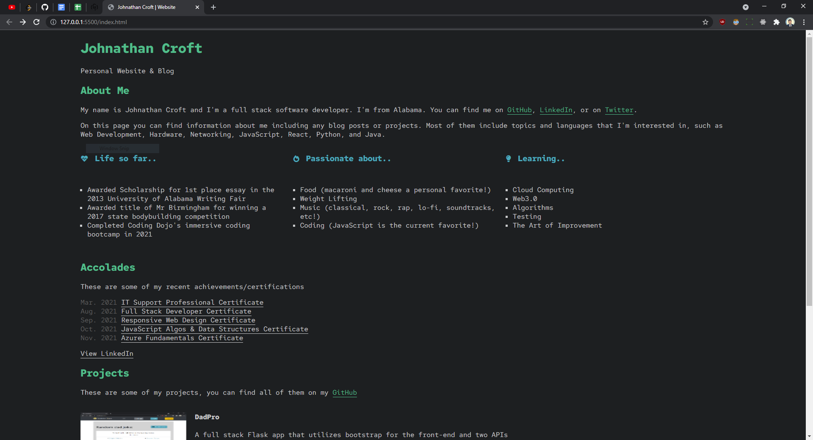

<div id="top"></div>


<!-- PROJECT SHIELDS -->
[![LinkedIn][linkedin-shield]][linkedin-url]

<!-- PROJECT LOGO -->
<br />

<div align="center">
  <a href="https://jmcroft7.github.io/portfolio2/">
    
  </a>
 </div>
 
<h3 align="center">Portfolio</h3>

<p align="center">
    A portfolio made using only html5 and css3.
</p>

<!-- ABOUT THE PROJECT -->

## About The Project

<p> The goal of this project was to practice different iterations of a personal website. This one utilizing no frameworks or JavaScript. This site is currently LIVE at <a href="https://jmcroft7.github.io/portfolio2/">https://jmcroft7.github.io/portfolio2/</a>
</p>


<p align="right">(<a href="#top">back to top</a>)</p>

### Built With

- HTML5
- CSS3

<p align="right">(<a href="#top">back to top</a>)</p>

### Installation

1. Clone the repo
   ```
   git clone https://github.com/jmcroft7/portfolio2.git
   ```
2. No NPM packages to install since it is just a static website.

<p align="right">(<a href="#top">back to top</a>)</p>

<!-- LICENSE -->

## License

Distributed under the MIT License. See `LICENSE.txt` for more information.

<p align="right">(<a href="#top">back to top</a>)</p>

<!-- CONTACT -->

## Contact

Johnathan Croft - [@devJohnathan](https://twitter.com/devJohnathan) - croftmjohn@gmail.com

Project Link: [https://github.com/jmcroft7/portfolio2](https://github.com/jmcroft7/portfolio2)

<p align="right">(<a href="#top">back to top</a>)</p>

<!-- MARKDOWN LINKS & IMAGES -->

[linkedin-shield]: https://img.shields.io/badge/-LinkedIn-black.svg?style=for-the-badge&logo=linkedin&colorB=555
[linkedin-url]: https://www.linkedin.com/in/devjohnathan/
